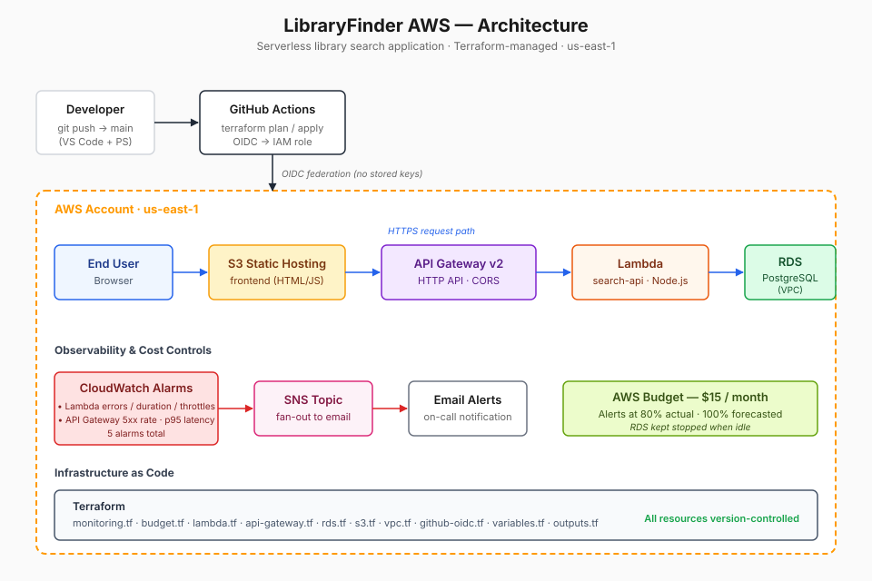
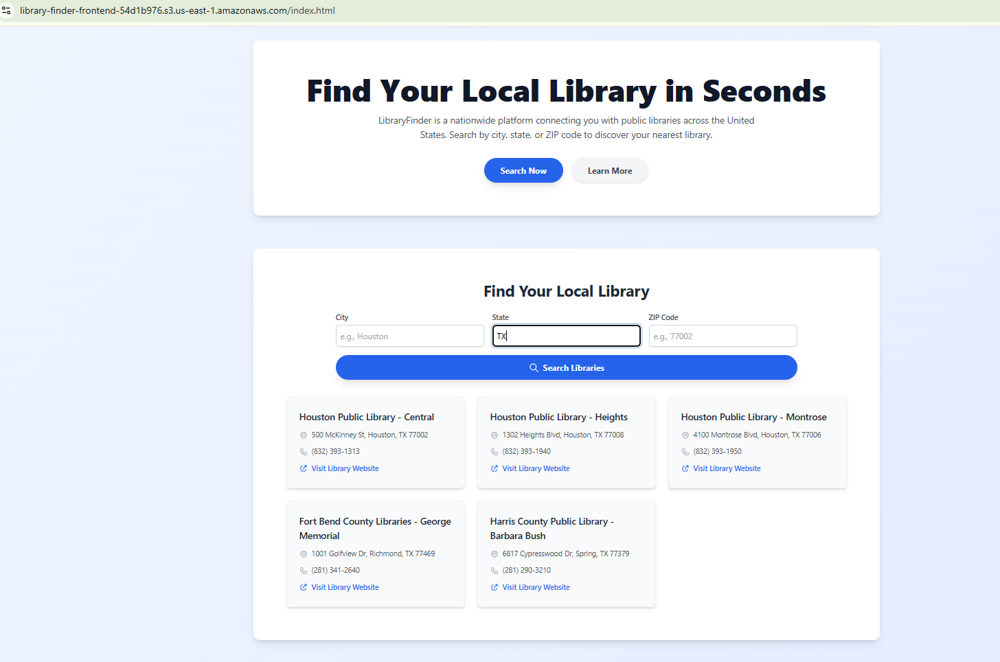
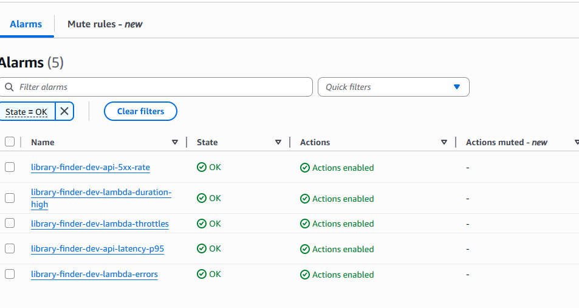

# LibraryFinder AWS

> A production-grade serverless library search application built on AWS — demonstrating end-to-end Infrastructure as Code, secure CI/CD, and production observability.

[](https://aws.amazon.com)
[](https://www.terraform.io)
[](https://github.com/features/actions)
[](LICENSE)

---

## 🎯 Overview

LibraryFinder is a cloud-native portfolio project that helps users discover public libraries. It's deliberately scoped to demonstrate production-ready AWS patterns across the full stack — not to ship a feature-complete product.

**What this project demonstrates:**

- **Infrastructure as Code** — every AWS resource defined in Terraform, deployable from a single `terraform apply`
- **Serverless architecture** — Lambda + API Gateway v2 (HTTP API) + RDS PostgreSQL
- **Secure CI/CD** — GitHub Actions with OIDC federation, zero stored AWS credentials
- **Production observability** — 5 CloudWatch alarms on key SLIs, SNS email delivery, verified end-to-end
- **Cost discipline** — AWS Budget guardrails, RDS stopped when idle

---

## 🏗️ Architecture



**Request path:** User → S3 (static frontend) → API Gateway v2 → Lambda → RDS PostgreSQL
**Alert path:** CloudWatch alarm breach → SNS topic → Email notification
**Deploy path:** `git push` → GitHub Actions (OIDC auth) → `terraform apply`

---

## 🚀 Technology Stack

### Cloud Infrastructure
- **Compute:** AWS Lambda (Node.js)
- **API:** API Gateway v2 (HTTP API)
- **Data:** RDS PostgreSQL
- **Frontend hosting:** S3 static website
- **Networking:** VPC, subnets, security groups
- **IAM:** least-privilege roles per service

### DevOps & Observability
- **IaC:** Terraform
- **CI/CD:** GitHub Actions with OIDC federation
- **Monitoring:** CloudWatch alarms + dashboards
- **Alerting:** SNS → email
- **Cost:** AWS Budgets

### Application
- **Backend:** Node.js Lambda handler
- **Frontend:** Static HTML + JavaScript
- **Database:** PostgreSQL with seeded library dataset

---

## 📂 Project Structure

```
library-finder-aws/
├── frontend/                         # Static site (S3)
├── backend/
│   └── lambda/
│       ├── search-api/               # Main API handler
│       └── db-setup/                 # DB bootstrap
├── terraform/
│   └── phase1-serverless/
│       ├── provider.tf
│       ├── vpc.tf                    # VPC + subnets
│       ├── security-groups.tf
│       ├── rds.tf                    # PostgreSQL
│       ├── s3.tf                     # Frontend bucket
│       ├── lambda-search-api.tf      # Search Lambda
│       ├── lambda.tf                 # DB setup Lambda
│       ├── github-oidc.tf            # CI/CD IAM role
│       ├── monitoring.tf             # CloudWatch + SNS
│       ├── budget.tf                 # AWS Budget
│       ├── variables.tf
│       └── outputs.tf
├── .github/workflows/                # CI/CD pipelines
├── docs/
│   └── architecture.svg              # Architecture diagram
└── README.md
```

---

## 🛠️ Quick Start

### Prerequisites
- AWS account with appropriate IAM permissions
- Terraform ≥ 1.5
- AWS CLI v2 configured
- Node.js ≥ 18 (for local development)

### Deployment

```bash
# Clone the repository
git clone https://github.com/mittal-jn/library-finder-aws.git
cd library-finder-aws/terraform/phase1-serverless

# Set required variables in terraform.tfvars (gitignored)
# See terraform.tfvars.example for the full list

# Deploy
terraform init
terraform plan
terraform apply
```

After deployment, confirm the SNS email subscription from your inbox — alarms won't deliver until confirmed.

### Local Development

```bash
# Test the Lambda handler locally
cd backend/lambda/search-api
npm install
npm test
```

---

## 📊 Monitoring & Observability

Five CloudWatch alarms cover the critical SLIs for a serverless API:

| Alarm | Metric | Threshold |
|---|---|---|
| `lambda-errors` | Lambda Errors (sum) | > 0 per 5 min |
| `lambda-duration-high` | Lambda Duration (avg) | > 80% of timeout |
| `lambda-throttles` | Lambda Throttles (sum) | > 0 per 5 min |
| `api-5xx-rate` | API Gateway `5xx / Count` | > 1% over 10 min |
| `api-latency-p95` | API Gateway Latency (p95) | > 2000 ms over 10 min |

All alarms publish to a single SNS topic with email subscription. Pipeline verified end-to-end via direct `aws sns publish` test.

---

## 🔒 Security

- **OIDC federation** — GitHub Actions assumes AWS IAM roles via short-lived tokens; no long-lived credentials stored as secrets
- **Least-privilege IAM** — separate roles per Lambda, permissions scoped to required actions only
- **Private networking** — RDS in private subnet, not publicly accessible
- **Credential hygiene** — `terraform.tfvars` and state files gitignored; secrets passed via `TF_VAR_*` env vars
- **Encryption** — RDS and S3 encrypted at rest

---

## 💰 Cost

Real monthly cost tracks close to **$0** when the environment is idle.

| Service | Active Cost | Idle Cost |
|---|---|---|
| RDS (db.t3.micro) | ~$12–15/mo | $0 (stopped) |
| Lambda | < $0.01 | $0 |
| API Gateway v2 | < $0.01 | $0 |
| S3 static hosting | < $0.50 | < $0.50 |
| CloudWatch alarms | ~$0.50/mo | ~$0.50/mo |
| SNS (email) | $0 | $0 |

**Cost controls in place:**
- AWS Budget at $15/month with email alerts at 80% actual and 100% forecasted
- RDS stopped when not in active development (dominant cost lever)
- Free-tier coverage for Lambda, S3, and CloudWatch basic tier

---

## 🚀 Phase History

| Phase | Status | Scope |
|---|---|---|
| **2A** — Core infrastructure | ✅ Complete | VPC, subnets, security groups, RDS, S3, IAM |
| **2B** — Search API | ✅ Complete | Lambda handler + API Gateway v2 (HTTP API), CORS |
| **3** — CI/CD pipeline | ✅ Complete | GitHub Actions + OIDC federation |
| **4** — Monitoring | ✅ Complete | 5 CloudWatch alarms + SNS + AWS Budget |

---

## 🗺️ Roadmap (candidate next phases)

- **CloudWatch Dashboard** — consolidated view of Lambda + API Gateway metrics
- **X-Ray distributed tracing** — enable on Lambda and API Gateway for request-level observability
- **Aurora Serverless v2 migration** — eliminate the RDS stop/start pattern, scale to zero
- **API Gateway caching** — reduce Lambda invocations for repeat queries
- **WAF integration** — rate limiting and common attack protection

---

## 💡 Lessons Learned

- **API Gateway v1 vs v2 metric dimensions differ** (`ApiName` vs `ApiId`, `5XXError` vs `5xx`). Getting this wrong causes alarms to silently never fire — Terraform will accept the config but metrics return no data.
- **Migrating from Lambda Function URLs to API Gateway** solved CORS issues cleanly. Taught me to reason about the request boundary separately from the compute layer.
- **OIDC federation** is one-time setup complexity for permanent security payoff — worth the extra hour on first config.
- **Alarm `ok_actions`** are a free built-in test of the notification path — no need to simulate failures to verify the alert pipeline works.

---

## 🎬 Demo

Full-stack application deployed and tested end-to-end:

- Frontend hosted on S3 (static HTML/JS)
- API served by Lambda behind API Gateway v2
- Data stored in PostgreSQL on RDS
- Environment spun down between demos for cost control — available on request


### Application UI

Search by city returns real library data from RDS PostgreSQL via Lambda and API Gateway:



### Monitoring in action

5 CloudWatch alarms monitoring the serverless stack — all healthy:




---

## 📄 License

MIT — see [LICENSE](LICENSE).

---

## 👤 Author

**Mittal Jain**
- GitHub: [@mittal-jn](https://github.com/mittal-jn)
- LinkedIn: [linkedin.com/in/mittaljain](https://www.linkedin.com/in/mittaljain/)

---

## 🙏 Acknowledgments

- AWS Documentation and Well-Architected Framework
- HashiCorp Learn (Terraform tutorials)
- Terraform AWS Provider registry

---

**⭐ Star this repo if you found it useful — feedback and suggestions welcome via GitHub Issues or LinkedIn.**
